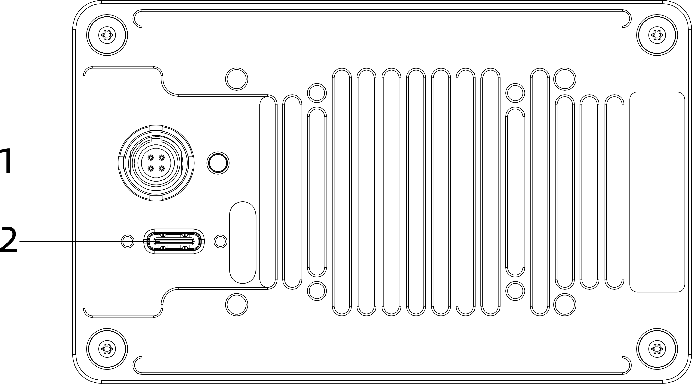

# 2. 硬件说明

## 2.1 物理接口

| 序号 | 接口类型     | 线缆型号               | 功能描述     |
| ------ | -------------- | ------------------------ | -------------- |
| 1    | 四芯航空插座 | FGG.0T系列推拉自锁插头 | 供电接口     |
| 2    | USB-C 3.0    | USB 3.0                | 高速数据输出 |

## 2.2 接口定义

| 四芯航空插座管脚 | 信号   | 属性  | 描述         | 线束颜色  | 功能         |
| ------------------ | -------- | ------- | -------------- | ----------- | -------------- |
| 1                | Power+ | Power | DC 9–24V    | 红(正极)  | 电源线       |
| 2                | FSYNC  | FSYNC | 双向同步信号 | 绿        | 硬同步信号线 |
| 3                | GP IO  | GP IO | 双向同步IO   | 蓝        | GP IO        |
| 4                | Ground | Power | Ground       | 黑 (负极) | 电源线       |

## 2.3 核心部件

| 序号             | 部件               |
| ---------------- | ------------------- |
| 1                | 激光发射端(TX)      |
| 2                | 激光接收端(RX)      |
| 3                | RGB相机             |

