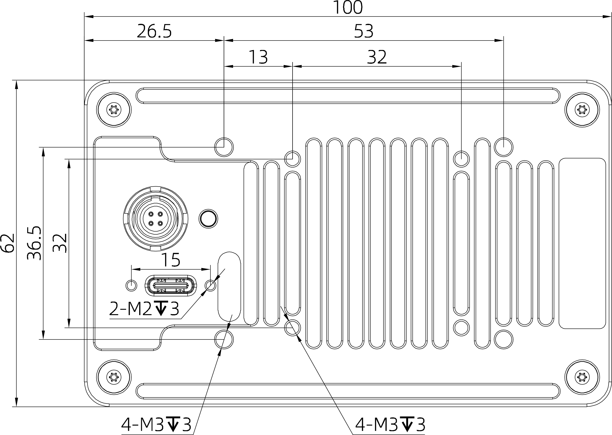
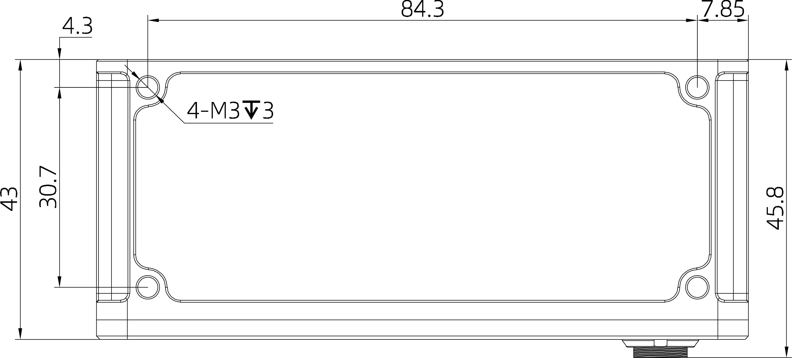
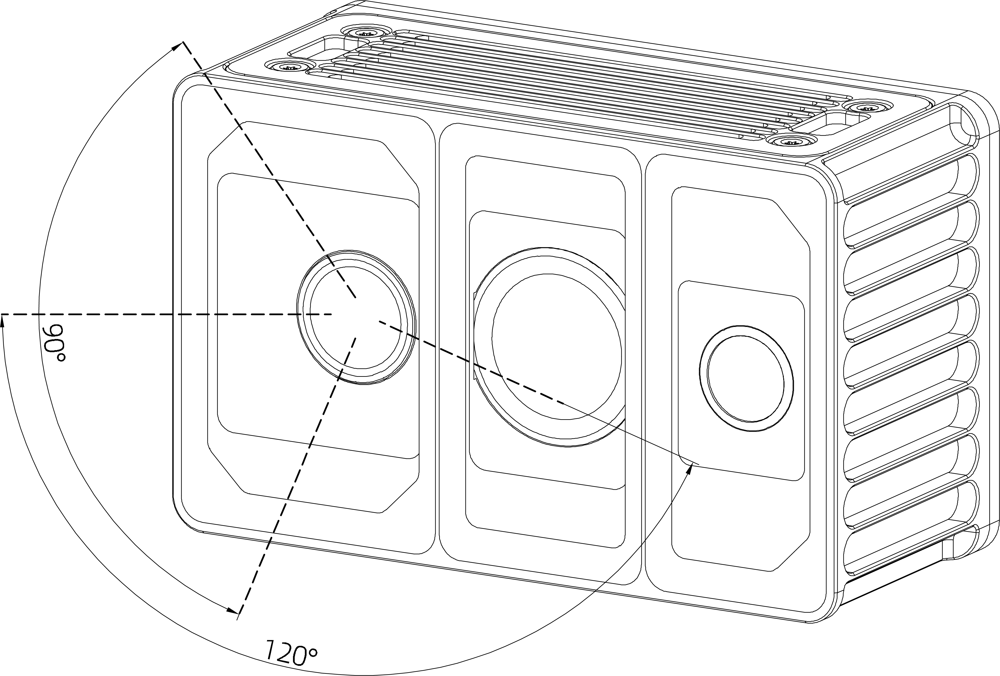
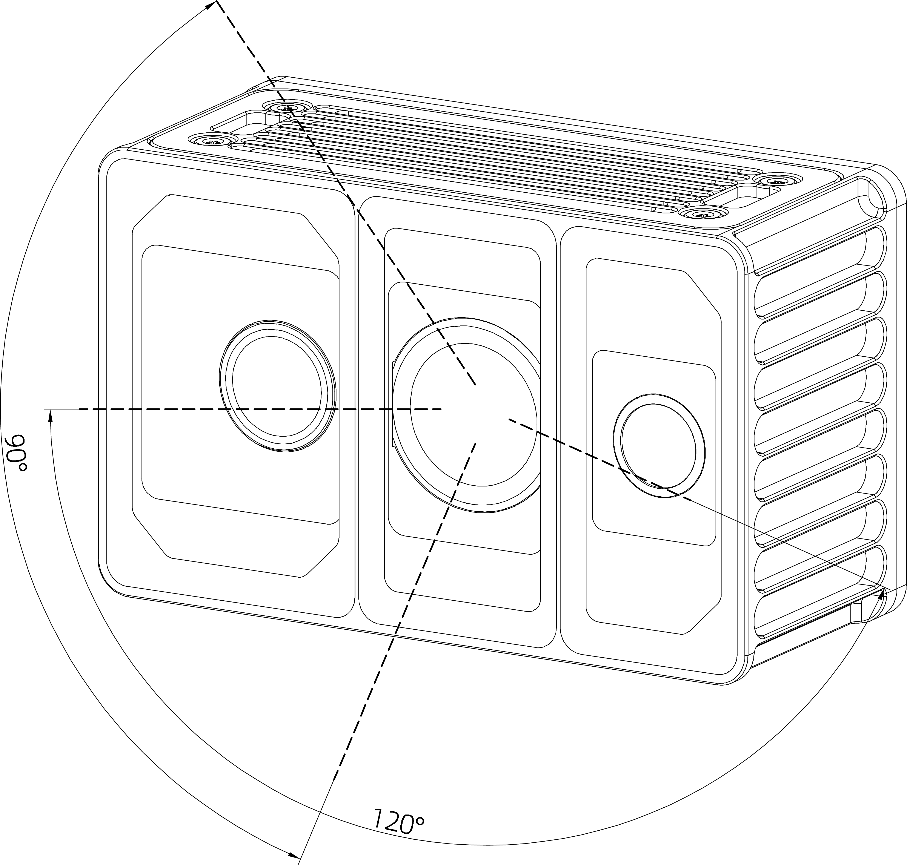
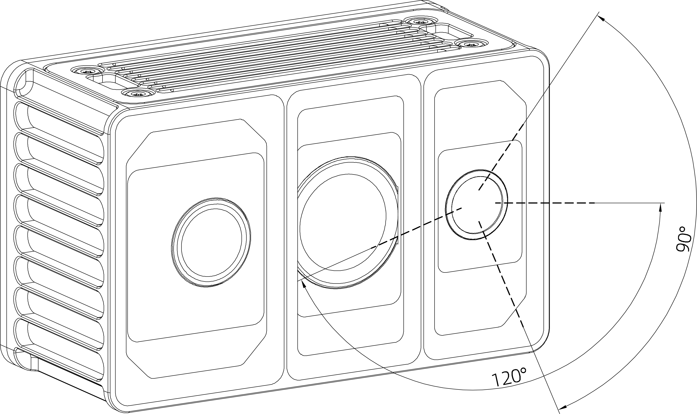

# 3. 安装指南

正式安装Odin1前,请阅读以下注意事项:

1. 清洁安装表面与窗口：

* 安装前，务必清除安装位置和激光雷达光学窗口上的灰尘、油污等脏污。建议使用干净的气吹除尘，再用无绒布（如镜头布）沾少许清水轻轻擦拭窗口，确保完全清洁。残留污渍会影响测量精度。

2. ⚠️确保视野无遮挡：

* 安装时，传感器前方视场角（FOV）区域 (0.2米内) 绝对不允许有任何遮挡物。特别注意： 即使是透明的玻璃、亚克力板等，安装在传感器正前方也会显著干扰激光信号，导致性能下降。

3. 灵活的安装方向（含优化建议）：

* 本产品支持任意方向安装（包括倒装）。倒装时： 设备底部距物体至少 0.2 米，以保证最佳性能。
* 设备会自动适应安装姿态（如倒装、倾斜），内部传感器会进行校准。

4.  ⚠️禁止施加额外负载：

* 设备的机身（尤其是散热外壳和光学窗口）不能承受额外重量或压力（例如在其上堆放物品或用力按压）。请仅通过设计好的安装接口（如底部的螺纹孔）进行固定。

5. ⚠️保障散热空间：

* 设备四周需留出足够的空间用于散热。要求： 设备本体与周围物体（如外壳内壁、线缆束等）的最小净空距离 ≥ 10mm，确保空气能顺畅流通，防止过热。

6. 稳固安装：

* 强烈建议将设备安装在结实的支架上，传感器下底部距离物体0.2米以上，以防遮挡视野。

## 3.1 机械安装

Odin1的底部有4个安装孔位+4个散热风扇安装孔位和侧部4个安装孔位。请根据下图所示的尺寸大小及安装孔位尺寸,将Odin1安装至合适位置。

|||
|-----------------|-----------------|

有效视场角（FOV）范围：

Odin1的深度FOV为大约120°H × 90°V，如下图所示。安装时请注意FOV有效范围，避免遮挡FOV区域。

