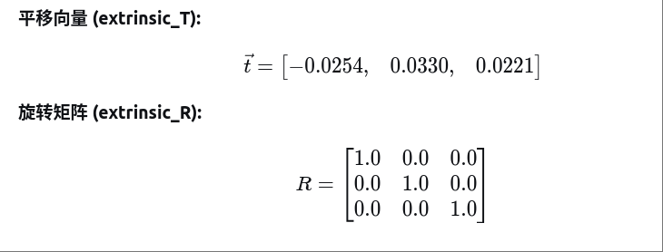

# 5. 数据输出

## 5.1 坐标系定义

Odin 1直角坐标的定义如下图所示，**I** 为imu坐标系，**L**为点云坐标系， **C**为相机坐标系。

## 5.2 外参描述

含义：P_imu = T^{imu}_{lidar}*P_lidar，其中的 T^{imu}_{lidar}是激光雷达相对于IMU的外参矩阵。

## 5.3 数据输出类型（ROS1 及 ROS2）

详细参考：[https://github.com/manifoldsdk/odin_ros_driver](https://)

