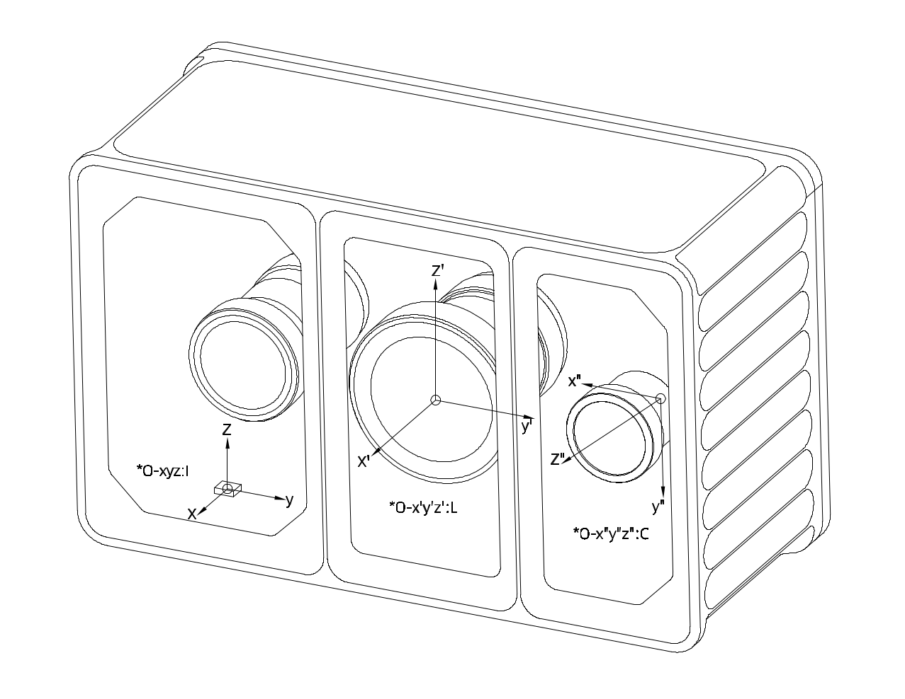
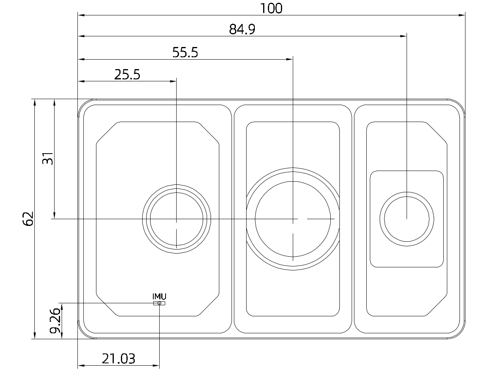
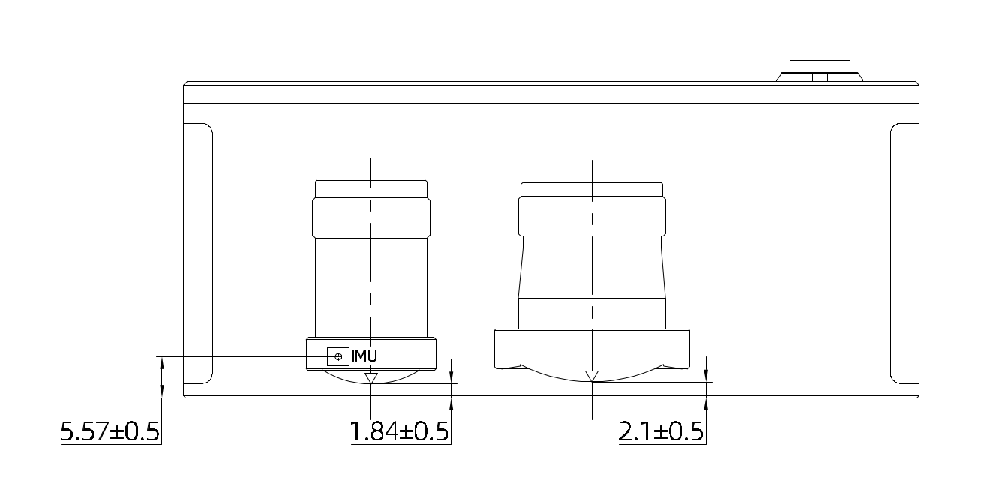

# 5. 数据输出

## 5.1 坐标系定义

Odin 1直角坐标的定义如下图所示，**I** 为imu坐标系，**L**为点云坐标系， **C**为相机坐标系。

## 5.2 外参描述

### 外参符号说明

下面使用 $$\mathbf{T}^{\text{A}}_{\text{B}}$$ 来表示坐标转换，具体含义为:

$$
\mathbf{P}_{\text{A}} = \mathbf{T}^{\text{A}}_{\text{B}} \cdot \mathbf{P}_{\text{B}}
$$

其中 $P_A$ 和 $P_B$ 分别表示物体在A坐标系和B坐标系下坐标。

### Camera - LiDAR

外参 $\mathbf{T}^{\text{lidar}}_{\text{camera}}$  不同机器存在差异，请在驱动程序启动后，在config文件夹获取，具体信息请查看驱动。

### IMU - LiDAR

外参 $\mathbf{T}^{\text{lidar}}_{\text{IMU}}$  是固定值，数值如下：

$$
\mathbf{T}^{\text{imu}}_{\text{lidar}} =
\begin{bmatrix}
1 & 0 & 0 & 0.00347 \\
0 & 1 & 0 & 0.03447 \\
0 & 0 & 1 & 0.02174 \\
0      & 0      & 0      & 1
\end{bmatrix}
$$

### 其它

- 如果需要 LiDAR 到 Camera 的外参，请根据上述自行计算。

## 5.3 数据输出类型（ROS1 及 ROS2）

详细参考：[https://github.com/manifoldsdk/odin_ros_driver](https://)

